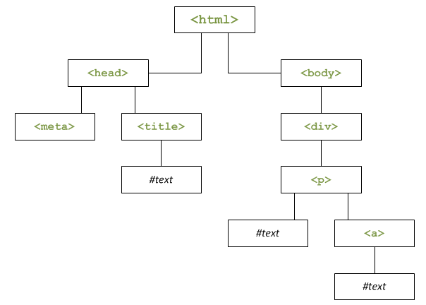

# JavaScript débarque dans le navigateur

----
----

# JavaScript dans le navigateur

----

## L'objet Window

Lorsque JavaScript est exécuté dans le navigateur, l'objet global est Window. Il représente la fenêtre du navigateur. Il possède des propriétés et des méthodes. On peut y accéder directement sans mettre le mot *window* car c'est l'objet global (il est dit implicite).
```js
// affiche la largeur du navigateur
console.log(window.innerWidth)
console.log(innerWidth)
```

- `alert()` n'est pas une fonction mais une méthode de l'objet window. `window.alert('Hello World')` est équivalent à `alert('Hello World')`
- en revanche isNan() ou parseInt ne dépendent pas d'un objet, ce sont des fonctions globales. Il n'y en a pas beaucoup
- lorsqu'on déclare une variable dans le contexte global du script, cette variable devient une propriété de l'objet window
toute variable non déclarée (utilisée sans écrire le mot-clé var) devient une propriété de window, quelque soit l'endroit où on se situe. Ecrire text = 'toto' revient donc à écrire window.text = 'toto'. Il est conseillé de toujours déclarer une variable avec var. Pour déclarer une variable globale dans une fonction, on pourra spécifier explicitement l'objet window

----

## L'objet Location

C'est une propriété de l'objet global Window. Il a lui-même des propriétés et des méthodes. Il contient des informations sur où se trouve notre navigateur (URL, etc...).

```js
location.reload() // relancer la page
location.replace("URL") // permet de change d'URL
```

----

## L'objet Document : le DOM

C'est une propriété de l'objet Window. C'est la représentation de notre page HTML, plus précisemment la la balise `<html>`. Avec JavaScript, on va manipuler le DOM. On peut voir les propriétés de l'objet document avec la commande `console.log(window)` et le contenu de l'objet document avec la commande `console.log(window.document)`.

Le document a des propriétés que l'on peut modifier, ajouter, déplacer, supprimer. Par exemple le titre de la page :
```js
console.log(document.title) // affiche : JavaScript (titre présent dans la page HTML)
document.title = "Mon nouveau titre"
console.log(document.title) // affiche :  Mon nouveau titre

console.log(document.body) // affiche le body
```

### Petit historique

Le DOM est une interface de programmation pour les documents XML et HTML, qui permet via le JavaScript d'accéder au code XML et/ou HTML d'un document. On peut modifier, ajouter, déplacer, supprimer des éléments HTML (une paire de balises HTML)

Au début du JavaScript, le DOM n'était pas unifié, c'est-à-dire que deux navigateurs possédaient un DOM différent, donc la manière d'accéder à un élément HTML différait d'un navigateur à l'autre. Il fallait donc coder différemment en fonction du navigateur. Le W3C a publié une nouvelle spécification DOM-1, pour DOM Level 1 qui définit le DOM et comment sont schématisés les documents HTML et XML, sous forme d'un arbre, ou d'une hiérarchie. L'élément <html> contient 2 éléments enfants : <head> et <body>, etc... Ensuite, la spécification DOM-2 a été publié avec l'introduction de la méthode getElementById() qui permet de récupérer un élément en connaissant son ID.

### La structure DOM

Le DOM pose comme concept que la page Web est une hiérarchie d'éléments. On peut schématiser une page web comme ceci :



Voici le code source correspondant :
```html
<!doctype html>
<html>
<head>
  <meta charset="utf-8" />
  <title>Le titre de la page</title>
</head>

<body>
  <div>
    <p>Du texte <a>et un lien</a></p>
  </div>
</body>
</html>
```

L'élément `<html>` contient deux éléments, appelés **enfants** : `<head>` et `<body>`. Pour ces deux enfants, `<html>` est l'élément **parent**. Chaque élément est appelé **noeud** (*node* en anglais). `<title>` contient un élément enfant `#text` qui contient du texte. Le texte présent dans une page Web est vu par le DOM comme on noeud de type `#text`.

----
----

# JavaScript et le DOM

----

## L'héritage des propriétés et des méthodes

Les éléments HTML sont vus par JavaScript comme des objets possédant des propriétés et des méthodes. Tous ne possèdent pas les mêmes propriétés et méthodes. Certaines sont communes car tous les éléments HTML sont d'un même type : Node.
Une <div> est un objet HTTMLDivElement, sous-objet HTMLElement, lui-même sous-objet d'Element, lui-même sous-objet de Node. Les méthodes et propriétés de Node peuvent être utilisées depuis ses sous-objets grâce à l'héritage.

----

## Hiérarchie des éléments

- `children` renvoie une *HTML Collection* (un peu comme un tableau) des enfants de l'élément
- `firstElementChild` et `lastElementChild` renvoient le premier et le dernier enfant de l'élément
- `nextElementSibling` renvoie le prochain élément de même niveau
- `parentElement` renvoie l'élément parent

```html
<body>
    <div>
        <p>Mon paragraphe 1</p>
        <p>Mon paragraphe 2</p>
    </div>
    <script src="script.js"></script>
</body>
```
```js
console.log(document.body.children) // [div, script]
console.log(document.body.children[0].children) // [p, p]
console.log(document.body.firstElementChild) // équivalent à children[0], retourne la div
console.log(document.body.children[0].nextElementSibling) // affiche le script
console.log(document.body.children[0].parentElement) // affiche le body
```

----

## Récupérer et modifier les éléments

Un `console.log()` d'un élément du DOM affiche la représentation HTML de l'élément, mais on ne voit pas ses propriétés. Pour voir les propriétés et méthodes d'un élément, il faut afficher tous les enfants de l'élément parent et cliquer sur l'élément enfant qui nous intéresse dans la console.

```js
console.log(document.body.children[0].children[1]) // affiche <p>Mon paragraphe 2</p>
console.log(document.body.children[0].children) // affiche l'HTML Collection avec ses 2 enfants. On peut cliquer sur chaque enfant pour voir ses attributs et méthodes
```

### Le contenu : innerHTML

`innerHTML` permet de récupérer le code HTML enfant d'un élément sous forme de texte. Si les balises sont présentes, `innerHTML` les retournera sous forme de texte. Exemple :
```html
<body>
    <div id="myDiv">
        <p>Un peu de texte <a>et un lien</a></p>
    </div>

    <script>
        const div = document.getElementById('myDiv')
        console.log(div.innerHTML) // affiche : <p>Un peu de texte <a>et un lien</a></p>
    </script>
</body>
```

Autre exemple où l'on va modifier le contenu du paragraphe :
```js
console.log(document.body.children[0].children[0].innerHTML) // affiche Un peu de texte <a>et un lien</a>
document.body.children[0].children[0].innerHTML = "<strong>Nouveau Texte</strong>"
console.log(document.body.children[0].children[0].innerHTML) // affiche Nouveau Texte (en gras car les les balises strong sont interprétées par le navigateur pour mettre le texte en gras)
```

Il est aussi possible d'ajouter ou d'éditer du HTML
```js
document.getElementById('myDiv').innerHTML = '<blockquote>Je mets une citation à la place du paragraphe</blockquote>'
document.getElementById('myDiv').innerHTML += ' et <strong>une portion mise en emphase</strong>.'
```
Il ne faut pas l'utiliser dans une boucle car `innerHTML` ralentit l'exécution du code. Il vaut mieux la concaténer dans une variable et ensuite ajouter le tout via `innerHTML`.


### innerText et textContent

`innerText` pour IE et `textContent` pour les autres navigateurs sont des propriétés analogues à `innerHTML`, qui permettent de récupérer le contenu d'un élément **sous forme de texte mais sans les balises**, et permet aussi de modifier le contenu de l'élément.
- `innerText` a été introduite dans IE, mais jamais standardisée et n'est pas suportée par tous les navigateurs
- `textContent` est la version standardisée d'`innerText`. Elle est reconnue par tous les navigateurs à l'exception des versions antérieures à IE9.

```js
console.log(document.body.children[0].children[0].textContent) // affiche Un peu de texte et un lien
document.body.children[0].children[0].textContent = "<strong>Nouveau Texte</strong>" // les balises ne sont pas interprétés par le navigateur mais écrites comme du texte affiché dans le navigateur
console.log(document.body.children[0].children[0].textContent) // affiche <strong>Nouveau Texte</strong>
```

----

## Modifier le style

La propriété `style` permet de modifier le style CSS des éléments. Les types correspondent au CSS sauf qu'il faut les écrire en kamel case. Par exemple écrire **backgroundColor** en JavaScript au lieu de **background-color** en CSS.

```js
document.body.children[0].style.backgroundColor = "red" // mais le fond de la div en rouge
```

----

## Modifier les classes CSS

```html
<body>
    <div class="super">
        <p>Mon paragraphe 1</p>
        <p>Mon paragraphe 2</p>
    </div>
    <script src="script.js"></script>
</body>
```

`classList` permet d'avoir la liste des classes CSS que possède un élément. Les méthodes `add()` et `remove()` permettent d'ajouter et d'enlever des classes CSS. `toggle()` permet d'enlever la classe si elle présente et de l'ajouter si elle n'y est pas.

```js
console.log(document.body.children[0].classList) // affiche ["super"]
document.body.children[0].classList.add("toto") // ajoute la classe toto à la div et applique son style
console.log(document.body.children[0].classList) // affiche ["super", "toto"]
document.body.children[0].classList.remove("toto") // enlève la classe toto de la div et enlève son style
console.log(document.body.children[0].classList) // affiche ["super"]
document.body.children[0].classList.toggle("toto")
console.log(document.body.children[0].classList) // affiche ["super", "toto"]
document.body.children[0].classList.toggle("toto")
console.log(document.body.children[0].classList) // affiche ["super"]
```

On peut aussi utiliser `className` pour appliquer une classe CSS à un élément : `document.getElementById('p1').className = 'bleu'`

----

## Modifier les attributs

Un attribut correspond aux informations présentes dans une balise, par exemple *src* dans la balise *script* : `<script src="index.js"></script>`. Les méthodes `getAttribute()` et `setAttribute()` permettent de récupérer et modifier un attribut d'un élément HTML.

```js
console.log(document.body.children[1].getAttribute("src")) // affiche index.js
document.body.children[1].setAttribute("src", "toto.js") // modifie la valeur de l'attribut renseignée
console.log(document.body.children[1].getAttribute("src")) // affiche toto.js
```

----

## Sélectionner les éléments

Pour sélectionner un élément, on peut le faire plus simplement qu'en partant de `body` et en descendant avec `children`. La méthode `getElementById()` de l'objet document permet de sélectionner un élément par son id, `getElementsByTagName()` sélectionne les éléments qui correspondent à un tag HTML, par exemple `h1` ou `p`, et `getElementsByClassName()` sélectionne les éléments qui correspondent à une classe CSS.  
On peut aussi stocker les éléments dans une variable.

```html
<body>
    <div class="super">
        <h1 id="titre">Mon Titre</h1>
        <p class="maClasse">Mon paragraphe 1</p>
        <p>Mon paragraphe 2</p>
    </div>
    <script src="script.js"></script>
</body>
```

```js
console.log(document.getElementById("titre")) // affiche <h1 id="titre">Mon Titre</h1>
console.log(document.getElementsByTagName("p")) // affiche une HTML Collection avec les 2 paragraphes
console.log(document.getElementsByClassName("maClasse")) // affiche une HTML Collection avec l'élément qui a cette classe

const monTitre = document.getElementById("titre")
console.log(monTitre) // affiche <h1 id="titre">Mon Titre</h1>
```

----

## Sélectionner avec Query Selector

La méthode `querySelector()` permet d'utiliser les sélecteurs CSS pour sélectionner un élément. Si plusieurs éléments correspondent, seul le premier élément sera sélectionné. La méthode `querySelectorAll()` renvoie une liste, et permet donc de sélectionner plusieurs éléments.

```js
console.log(document.querySelector(".maClasse")) // affiche <p class="maClasse">Mon paragraphe 1</p>
console.log(document.querySelectorAll(".maClasse")) // affiche une NodeList d'un élément avec le paragraphe 1

console.log(document.querySelector("p")) // affiche <p class="maClasse">Mon paragraphe 1</p> (le 1er paragraphe rencontré)
console.log(document.querySelectorAll("p")) // affiche une NodeList de deux éléments avec les paragraphes
```

----

## Modifier l'ordre des éléments

La méthode `insertBefore()` permet d'insérer un élément HTML avant un autre élément. Si l'élément existe déjà, il est d'abord supprimé avant d'être replacé. La méthode `appendChild()` permet d'ajouter un élément à un autre élément en tant qu'enfant. La méthode `replaceChild()` permet de remplacer un élément enfant par un autre. La méthode `removeChild()` permet de supprimer un élément, `remove()` le permet aussi de manière plus simple mais n'est pas supporté par les anciennes versions des navigateurs.

```html
<link rel="stylesheet" href="style.css">
<body>
    <div class="rouge">Rouge</div>
    <div class="vert">Vert</div>
    <div class="bleu">Bleu</div>
    <script src="script.js"></script>
</body>
```
```css
.rouge, .vert, .bleu {
    width: 300px;
    height: 100px;
    color: white;
    font-size: 40px;
    text-align: center;
}
.rouge {
    background-color: red;
}
.vert {
    background-color: green;
}
.bleu {
    background-color: blue;
}
```

```js
const rouge = document.querySelector(".rouge")
const vert = document.querySelector(".vert")
const bleu = document.querySelector(".bleu")

document.body.insertBefore(bleu,vert) // insère l'élément bleu avant l'élément vert

rouge.appendChild(bleu) // ajoute l'élément bleu en tant qu'enfant de rouge

document.body.replaceChild(bleu, rouge) // remplace l'élément rouge par l'élément bleu

bleu.parentElement.removeChild(bleu) // permet de supprimer l'élément bleu
bleu.remove() // permet aussi de supprimer l'élément bleu mais n'est pas supporté par les anciens navigateurs
```

----

## Créer des éléments

Pour créer un élément, on va utiliser la méthode `createElement()` que l'on va ensuite insérer dans le DOM avec la méthode `appendChild()`

```css
/* creation d'une classe CSS jaune que l'on va appliquer sur un élément que l'on va créer en JS */
.jaune {
    width: 300px;
    height: 100px;
    color: white;
    font-size: 40px;
    text-align: center;
    background-color: yellow
}
```

```js
const jaune = document.createElement("div") //création d'un élément div
jaune.classList.add("jaune") // application de la classe jaune sur la div
jaune.textContent = "Jaune" // ajout du texte Jaune dans la div
document.body.appendChild(jaune) // insertion de l'élément jaune en tant qu'enfant du body
```

Exemple de création d'une fonction qui crée des éléments que l'on va appeler plusieurs fois pour remplir une liste

```html
<body>
    <ul></ul>
    <script src="script.js"></script>
</body>
```
```js
function planifierTache(heure, tache){
    const nouvelleTache = document.createElement("li")
    nouvelleTache.innerHTML = `<h3>${heure}</h3><p>${tache}</p>` // innerHTML permet de dire le code HTML que l'on veut mettre à l'intérieur d'un élément HTML
    document.querySelector("ul").appendChild(nouvelleTache)
}

planifierTache('7h30', 'Réveil')
planifierTache('7h40', 'Petit-déjeuner')
planifierTache('8h00', 'Douche')
```

----
----

# Les événements Javascript

----

## Qu'est-ce qu'un événement ?

Les événements permettent de déclencher une fonction selon qu'une action s'est produite ou non, par exemple faire apparaître une fenêtre `alert()` au survol d'une zone d'un élément. Ils sont de différentes natures, par exemple :
- cliquer sur un élément
- appuyer sur une touche du clavier
- lorsque le navigateur a fini de charger la page Web

Un événement est basé sur l'interface `Event`, avec par exemple les classes `MouseEvent`et `KeyboardEvent` pour les événements liés à la souris et au clavier.

----

## On-Event Handler

```html
<body>
    <div class="rouge">Rouge</div>
    <div class="vert">Vert</div>
    <div class="bleu">Bleu</div>
    <script src="index.js"></script>
</body>
```

```js
console.log(rouge) // affiche <div class="rouge">Rouge</div>
console.log(rouge.parentElement.children) // affiche la collection HTML des éléménts enfants du parent, dont rouge, pour lesquels on peut voir les propriétés et méthodes
```

Les propriétés qui commencent par `on` sont liés aux événements. Elles sont appelées **On-Event Handler**, que l'on peut traduire par **gestionnaire d'événements**. Par exemple, la propriété `onload` gère l'événement `load`.

L'événement **load** se produit quand la page a fini de se charger :
```js
window.onload = function(){
    console.log("la page est chargée")
}
console.log("après le onload") // s'affiche AVANT "la page est chargée"
```

On peut aussi déclarer une fonction et l'appeler sur la propriété onload :
```js
function windowReady(){
    console.log("la page est chargée")
}

window.onload = windowReady()
```

On peut encapsuler tout le code JS dans un `windows.onload` pour s'assurer que tous les éléments que l'on manipule sont chargés :
```js
window.onload = function(){
    const rouge = document.querySelector(".rouge")
    const vert = document.querySelector(".vert")
    const bleu = document.querySelector(".bleu")
}
```

Exemple de l'événement clic, déclenché à chaque clic sur l'élément rouge :
```js
rouge.onclick = function(event){
    console.log("clic sur la div rouge !")
    console.log(event)
}
```
On peut récupérer l'événement en le passant en argument de la fonction en lui donnant le nom que l'on veut car le fait de mettre un argument à la fonction nous donne forcément l'événement.

On peut écrire les Event Handler directement dans le code HTML, ce qui n'est pas conseillé :
```html
<div class="vert" onclick="console.log('toto')">Vert</div>
```

On ne peut pas définir plusieurs fois le même event handler sur le même élément. Auquel cas, seul le dernier event handler va fonctionner car c'est une propriété à laquelle on attache une fonction, donc la dernière a écrasée les précédentes.
```js
rouge.onclick = function(event){
    console.log("clic sur la div rouge !")
    console.log(event)
}

rouge.onclick = function(){
    console.log("deuxième message") // seul ce message va s'afficher
}
```

----

## Event Listener

Un **Event Listener**, ou **écouteur d'événement** en français, est une autre façon d'interagir avec les événements.

Il faut utiliser la méthode `addEventListener()` qui prend en argument le nom de l'événementet la fonction a exécuter :
```js
rouge.addEventListener("click", function(event){
    console.log("clic sur la div rouge !")
    console.log(event)
})

function afficherMessage(){
    console.log("deuxième message")
}

rouge.addEventListener("click", afficherMessage)
```

On peut ajouter plusieurs event listener sur le même événement et sur le même élément, ils seront tous exécutés. On peut aussi déclarer une fonction en externe et l'appeler dans le listener **sans l'exécuter**, juste en marquant son nom. La fonction anonyme en argument n'était pas éexécutée non plus, le listeneur le fait quand l'événement a lieu.

On peut aussi supprimer un event listener avec `removeEventListener()`. Dans l'exemple suivant, quand on clique sur vert, on enlève le deuxième event listener de rouge, et quand on clique ensuite sur rouge, il n'y a plus que le premier qui s'exécute :
```js
vert.addEventListener("click", function(){
    rouge.removeEventListener("click", afficherMessage)
})
```

----

## Propagation des événements

```html
<div id="parent">
    <div id="enfant"></div>
</div>
<script src="index.js"></script>
```

```css
#parent {
    width: 300px;
    height: 300px;
    background-color: red;
}

#enfant {
    width: 100px;
    height: 100px;
    background-color: blue;
}
```

```js
const parent = document.querySelector("#parent")
const enfant = document.querySelector("#enfant")

parent.addEventListener("click", parentFonction)
enfant.addEventListener("click", enfantFonction)


function enfantFonction(){
    console.log("clic sur l'enfant")
}

function parentFonction(){
    console.log("clic sur le parent")
}
```

Dans cet exemple, il y a une div bleu enfant contenu dans une div rouge rouge. Lorsqu'on clique sur la div parent, `clic sur le parent` s'écrit dans la log, et lorsqu'on clique sur la div enfant, `clic sur l'enfant` puis `clic sur le parent` s'affichent car l'enfant est contenu dans le parent.

Les événements sont faits de deix phases :
- phase de **capture** : part des parents et va vers les enfants
- phase de **bouillonnement** (**event bubbling**) : part de l'enfant et va vers les parents

Par défaut, addEventListener s'exécute pendant la phase de bouillenement (les événements débutent par les enfants et remontent vers les parents). Pour qu'elle s'exécute pendant la phase de capture, il faut ajouter un troième argument `true` à la méthode `addEventListener`. Dans l"exemple suivant, lorsqu'on clique sur la div enfant, `clic sur parent` s'affiche donc avant `clic sur enfant` :
```js
parent.addEventListener("click", parentFonction, true)
enfant.addEventListener("click", enfantFonction, true)
```

----

## Propriétés de l'objet Event

Certaines propriétés sont communes à tous les événements, d'autres sont spécifiques à certains événement comme les événements souris, ou les événements claviers :
```js
function parentFonction(event){
    console.log("clic sur le parent")
    console.log(event)
    console.log(event.type) // affiche : click, correspond au type de l'événement
    console.log(event.target) // affiche la div parent, correspond à l'élément qui a débuté l'événement
    console.log(event.currentTarget)

    console.log(event.clientX) // affiche où l'on se place sur l'axe horizontale, propriété spécifique au MouseEvent
    
}
```

----

## Méthodes de l'objet Event

La méthode `stopPropagation()` permet de stopper la propagation d'un événement. Dans l'exemple suivant, en cliquant sur l'enfant, on ne verra que le clic sur l'enfant mais pas le clic sur le parent. L'événement a été stoppé et n'a donc pas atteint la div parent.
```js
function enfantFonction(event){
    console.log("clic sur l'enfant")
    event.stopPropagation()
}
```

----
----

# Requêtes HTTP - Ajax

----

## Qu'est-ce qu'une requête HTTP ?

Ajax est un raccourci pour **Asynchronous JavaScript and XML** (XML et JavaScript asynchrones).

Ajax permet d'échanger avec le serveur via des requêtes HTTP sans rafraîchir toute la page mais uniquement certains élément de la page. Ces requêtes fonctionnent de manière asynchrones, c'est-à-dire que l'on traitera la réponse quand elle arrive sans attendre qu'elle arrive, ce qui permet de continuer à exécuter la suite du code.

## Requêtes HTTP avec XMLHttpRequest

`XMLHttpRequest` est l'objet qui permet de faire des requêtes Ajax. C'est l'objet de base qui sert à faire des requêtes HTTP. D'autres objets se basent dessus.

Lors d'une requête HTTP, son état va varier, et nous pouvons récupérer chaque changement de cet état, avec l'événement `onreadystatechange`. L'état varie de 0 à 4. La requête est terminée à l'état 4.

Exemple avec l'API Jsonplaceholder sur l'URL `/posts` en GET :
```js
const req = new XMLHttpRequest()
const method = 'GET'
const url = 'https://jsonplaceholder.typicode.com/posts'

req.onreadystatechange = function(event){
    if(this.readyState === XMLHttpRequest.DONE){// on aurait pu écrire 4 à la place, c'est pareil
        if(this.status === 200){
            console.log(
                JSON.parse(this.responseText)
            )
        } else {
            console.log("Statut Erreur : "+this.status)
        }
    }
}

req.open(method, url)
req.send()
```
Exemple d'une requête en POST :
```js
const req = new XMLHttpRequest()
const method = 'POST'
const url = 'https://jsonplaceholder.typicode.com/posts'

const data = {
    body: "la la la",
    title: "mon titre",
    userId: 1
}

req.onreadystatechange = function(event){
    if(this.readyState === XMLHttpRequest.DONE){// on aurait pu écrire 4 à la place, c'est pareil
        if(this.status === 201){
            console.log(
                JSON.parse(this.responseText)
            )
        } else {
            console.log("Statut Erreur : "+this.status)
        }
    }
}

req.open(method, url)
req.send(data)
```

La méthode `open()` prend en argument la méthode HTTP puis l'url à appeler. Il y a ensuite des arguments optionels : `XMLHttpRequest.open(method, url, async, user, password)`
- `async` : à *true* par défaut. On peut le mettre à *false* pour faire des requêtes synchrones, ce qui est déconseillé
- `user` et `password` sont *null* par défaut et servent à l'authentification
