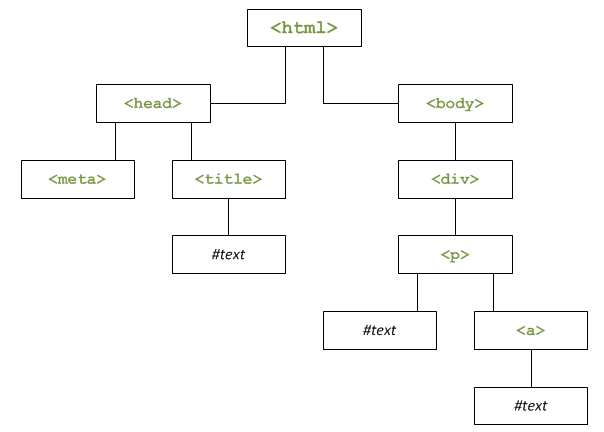

# Manipuler le code HTML (partie 1/2)

---

## Le Document Object Model

### Petit historique

Le DOM est une interface de programmation pour les documents XML et HTML, qui permet via le JavaScript d'accéder au code XML et/ou HTML d'un document. On peut modifier, ajouter, déplacer, supprimer des éléments HTML (une paire de balises HTML)

Au début du JavaScript, le DOM n'était pas unifié, c'est-à-dire que deux navigateurs possédaient un DOM différent, donc la manière d'accéder à un élément HTML différait d'un navigateur à l'autre. Il fallait donc coder différemment en fonction du navigateur. Le W3C a publié une nouvelle spécification DOM-1, pour *DOM Level 1* qui définit le DOM et comment sont schématisés les documents HTML et XML, sous forme d'un arbre, ou d'une hiérarchie. L'élément `<html>` contient 2 éléments enfants : `<head>` et `<body>`, etc... Ensuite, la spécification DOM-2 a été publié avec l'introduction de la méthode **getElementById()** qui permet de récupérer un élément en connaissant son ID.

### L'objet window

C'est un objet glabal qui représente la fenêtre du navigateur. C'est à partir de cet objet que le JavaScript est exécuté.
- `alert()` n'est pas une fonction mais une méthode de l'objet `window`
- l'objet `window` est dit implicite, c'est-à-dire qu'il n'y a pas besoin de la spécifier. `window.alert('Hello World')` est équivalent à `alert('Hello World')`. En général, on ne le marque pas sauf si cela est nécessaire
- en revanche `isNan()` ou `parseInt` ne dépendent pas d'un objet, ce sont des **fonctions globales**. Il n'y en a pas beaucoup
- lorsqu'on déclare une variable dans le contexte global du scipt, cette variable devient une propriété de l'objet `window`
- toute variable non déclarée (utilisée sans écrire le mot-clé `var`) devient une propriété de `window`, quelque soit l'endroit où on se situe. Ecrire `text = 'toto'` revient donc à écrire `window.text = 'toto'`. Il est conseillé de toujours déclarer une variable avec `var`. Pour déclarer une variable globale dans une fonction, on pourra spécifier explicitement l'objet `window`

### Le document

L'objet `document` est un sous-objet de `window`, il représente la page Web, plus précisemment la la balise `<html>`. C'est grâce à cet élément qui nous allons pouvoir accéder aux éléments HTML et les modifier.

---

## Naviguer dans le document

### La structure DOM

Le DOM pose comme concept que la page Web est une hiérarchie d'éléments. On peut schématiser une page web comme ceci :



Voici le code source correspondant :
```html
<!doctype html>
<html>
<head>
  <meta charset="utf-8" />
  <title>Le titre de la page</title>
</head>

<body>
  <div>
    <p>Du texte <a>et un lien</a></p>
  </div>
</body>
</html>
```

L'élément `<html>` contient deux éléments, appelés **enfants** : `<head>` et `<body>`. Pour ces deux enfants, `<html>` est l'élément **parent**. Chaque élément est appelé **noeud** (*node* en anglais). `<title>` contient un élément enfant `#text` qui contient du texte. Le texte présent dans une page Web est vu par le DOM comme on noeud de type `#text`.

### Accéder aux éléments

L'objet `document` possède 3 méthodes principales :
- `getElementById()` qui permet d'accéder à un élément en connaissant son ID. Exemple : `var div = document.getElementById('myDiv');` pour récupérer une division appelée *myDiv*. La variable créée *div* contient le texte *object HTTMLDivElement*, en clair un élément HTML de type `<div>`.
- `getElementsByTagName()` permet de récupérer sous forme de tableau tous les éléments de la famille. Exemple pour récupérer toutes les `<div>` : `var divs = document.getElementsByTagName('div');`. En mettant un astérique (\*) en paramètre, on récupère tous les éléments HTML dans l'élément ciblé
- `getElementsByName()` permet de ne récupérer que les éléments qui possèdent un attribut `name` que l'on spécifie. L'attribut `name` n'est utilisé que dans les formulaires, il est déprécié pour toute autre utilisant depuis HTML5.

**Accéder aux éléments grâce aux technologies récentes**

`querySelector()` et `querySelectorAll()` sont 2 méthodes récentes (non supportées avant IE8) qui simplifient la sélection dans l'arbre DOM en prenant en prenant en paramètre un sélecteur CSS.  
Par exemple, le sélecteur `#menu .item span` sélectionne les balises `<span>` des classes `.item` elles-mêmes contenues dans l'identifiant `#menu`

- `querySelector()` renvoie le premier élément trouvé correspondant au sélecteur
- `querySelectorAll()` renvoie tous les éléments sous forme de tableau

Exemple :
```html
<div id="menu">
  <div class="item">
    <span>Élément 1</span>
    <span>Élément 2</span>
  </div>
</div>
```
```javascript
var query = document.querySelector('#menu .item span'),
    queryAll = document.querySelectorAll('#menu .item span');

alert(query.innerHTML); // Affiche : "Élément 1"

alert(queryAll.length); // Affiche : "2"
alert(queryAll[0].innerHTML + ' - ' + queryAll[1].innerHTML); // Affiche : "Élément 1 - Élément 2"
```

La propriété `innerHTML` permet d'accéder au contenu d'un élément HTML.

**L'héritage des propriétés et des méthodes**

Les éléments HTML sont vus par JavaScript comme des objets possédant des propriétés et des méthodes. Tous ne possèdent pas les mêmes propriétés et méthodes. Certaines sont communes car tous les éléments HTML sont d'un même type : `Node`.  
Une `<div>` est un objet `HTTMLDivElement`, sous-objet `HTMLElement`, lui-même sous-objet d'`Element`, lui-même sous-objet de `Node`. Les méthodes et propriétés de `Node` peuvent être utilisées depuis ses sous-objets grâce à **l'héritage**.

---

## Editer les éléments HTML

---

## innerText et textContent
